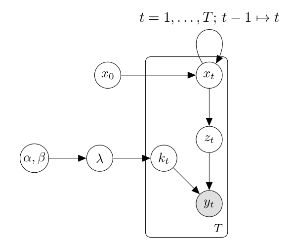

# hphmm - hybrid hidden Markov models with Poisson noise

## Overview

hphmm implements an approximate hybrid hidden Markov
model for event counts with Poisson noise. The posterior
distribution is approximated by a factorisation consisting
of an approximate conditional posterior distribution for
the Poisson noise rate given the hidden state, and a
discrete posterior distribution over the hidden state.

The approximation scheme is an instance of assumed density
filtering: a single Gamma distribution approximates each
conditional posterior distribution for the Poisson noise rate.

### License

BSD

### Status

Prototype. Library API may change.


HMM capabilities -- implemented:

*	"filtering" -- estimating the posterior distribution at the
	current time `t` over latent variables given evidence to date `y_{1:t}`

HMM capabilities -- not implemented:

*	"smoothing" -- estimating the posterior distribution over latent
	variables given the evidence to date, for some historical time `t < T`
*	"prediction" -- estimating the posterior distribution over latent
	variables at future times `t > T` given evidence to date
*	most likely explanation -- recovering a trajectory of latent states
	that is best, in some particular sense (e.g. via Viterbi algorithm)
*	estimation -- estimating the parameters of the Markov model from
	training data (e.g. via the Baum-Welch algorithm)

Lower-level approximation capabilities -- implemented:

*	approximation of a mixture of Gamma distribution by a single Gamma
	distribution that minimises the KL divergence from the approximation
	to the original mixture.


### Model

Consider a discrete hidden Markov model which emits an
integer event count `z_t` each time step, that is combined
with an additive Poisson noise `k_t` to produce an
observed event count `y_t = z_t + k_t`:



The posterior distribution over the hidden state `x_t` and
the noise rate `\lambda` can be decomposed as

```
P(x_t, \lambda | y_{1:t}) = P(\lambda | x_t, y_{1:t} ) P( x_t | y_{1:T})
```

where the first factor can be approximated by a Gamma distribution

```
P(\lambda | x_t, y_{1:t} ) \approx Gamma(\lambda ; \alpha, \beta)
```

where the parameters `\alpha, \beta` of the Gamma distribution depend
upon the current time step `t` and the hidden state `x_t`.

### Comparison of approximation schemes on synthetic problems

In each synthetic problem we

*   generate a random hidden Markov model with
    *   between n = 250 and 5000 hidden states, structured as the disjoint union of 50 to 500 component models
    *   a sparse transition matrix (at most three nonzero transitions per state)
    *   a signal model able to emit event counts in the range {0, 1, ..., 5}
*   define a uniform prior for the initial state
*   define a random prior for the noise rate
*   sample a Poisson noise rate
*   compute the factorial model of the hidden Markov model with the noise model
*   sample a random trajectory for 100 -- 500 timesteps

During each experiment we allow each competing HMM algorithm to know

*   the exact transition matrix
*   the exact signal matrix
*   the prior over the noise rate and the initial state

Importantly, each competing algorithm is not permitted to know the true
noise rate or the decomposition of each observation into signal and noise
components, this must be inferred.

We condition each competing algorithm on the observations from the random
trajectory and then compute the log-probability of the data.


We compare the following algorithms:

1.  `HPHMM` -- the approximation scheme where we assume the posterior distribution for the noise rate, conditioned on the hidden state, is approximated as a Gamma distribution. This model requires `3 * n` parameters per belief state vector.

2.  `FGHMM(r)` -- a simple grid approximation scheme where we approximate the unknown noise rate by sampling `r` fixed noise rate values from a uniform grid across the prior distribution for the noise rate. We then define a model consisting of the disjoint union of `r` copies of the HMM, each with one of the fixed `r` noise rates. This model requires `r * n` parameters per belief state vector.

3.  `Oracle` -- to define a "best-possible" benchmark, we compare against an Oracle HMM algorithm that is allowed to cheat and use the true noise rate as a parameter, so there is no need to infer the noise rate. This model is implemented as an `FGHMM(r=1)` model. requires `n` parameters per belief state vector.


#### Results (log probability)

The table below shows the log posterior probability of the observed data estimated by
each algorithm. Higher is better.

```
results (log-prob):
     HPHMM()	  FGHMM(r=1)	  FGHMM(r=5)	 FGHMM(r=10)	 FGHMM(r=20)	    Oracle()
      -757.2	      -755.8	      -757.2	      -757.2	      -757.2	      -748.0
      -260.6	      -411.0	      -264.9	      -261.1	      -260.8	      -257.0
      -229.3	      -229.4	      -229.1	      -229.1	      -229.2	      -223.7
      -607.3	      -661.4	      -606.7	      -606.8	      -606.8	      -597.1
      -304.1	      -327.9	      -305.2	      -304.2	      -303.8	      -298.6
      -927.9	      -927.7	      -928.1	      -928.0	      -928.0	      -923.5
      -512.5	      -512.2	      -512.6	      -512.6	      -512.6	      -505.8
      -970.8	      -974.7	      -970.4	      -970.7	      -970.7	      -965.2
      -164.1	      -164.0	      -164.0	      -164.1	      -164.1	      -167.2
      -490.1	      -499.3	      -487.3	      -495.9	      -490.3	      -479.8
      -424.1	      -424.0	      -424.0	      -424.0	      -424.0	      -419.8
      -593.3	      -604.6	      -592.7	      -593.2	      -593.2	      -584.9
      -888.9	      -887.6	      -888.9	      -889.0	      -888.9	      -886.2
      -255.5	      -257.0	      -255.5	      -255.5	      -255.5	      -247.7
      -897.5	      -903.9	      -897.9	      -897.2	      -897.2	      -891.8
      -248.1	      -252.8	      -248.7	      -248.6	      -248.6	      -242.0
      -665.5	      -669.5	      -665.1	      -665.5	      -665.5	      -656.4
      -755.1	      -763.2	      -756.7	      -755.2	      -755.3	      -746.5
      -493.2	      -494.6	      -494.2	      -493.6	      -493.3	      -485.9
      -289.9	      -291.4	      -290.9	      -291.1	      -291.1	      -283.8
     -1331.7	     -1338.6	     -1331.1	     -1331.7	     -1331.6	     -1326.5
      -387.3	      -387.4	      -387.4	      -387.3	      -387.3	      -381.9
      -443.8	      -458.4	      -443.3	      -443.9	      -443.9	      -435.6
      -445.7	      -445.5	      -445.7	      -445.7	      -445.7	      -438.6
      -593.9	      -596.8	      -593.9	      -594.1	      -594.1	      -585.4
      -540.3	      -538.8	      -540.2	      -540.2	      -540.2	      -532.7
      -411.4	      -410.5	      -411.8	      -411.7	      -411.7	      -407.6
      -509.7	     -1163.0	      -511.9	      -512.8	      -509.1	      -506.6
      -395.4	      -396.4	      -395.0	      -395.4	      -395.4	      -389.2
      -511.4	      -525.2	      -511.4	      -511.4	      -511.4	      -502.6
```

Comments:

*	For the FGHMM grid approximation scheme, on this set of synthetic examples, there
	does not seem to be much benefit to increasing the number of grid points `r` used
	to approximate the noise rate beyond `r=5`.
*	HPHMM and FGHMM(r=5) have comparable results
*	In some rare cases FHGMM(r=1), which assumes the noise rate takes the median value
	of the noise rate posterior distribution, has dramatically worse log-probability
	scores than the other methods.

#### Results (running times)

Running times (in seconds) on the 30 synthetic
scenarios are reported below.

```
HPHMM	FGHMM	FGHMM	FGHMM	FGHMM	Oracle
	(r=1)	(r=5)	(r=10)	(r=20)
0.4070	0.0804	0.3988	0.8066	1.5999	0.0373
0.1167	0.0211	0.1055	0.2134	0.4314	0.0104
0.1349	0.0369	0.1829	0.3664	0.7382	0.0170
0.2768	0.0701	0.3669	0.7356	1.4864	0.0345
0.1406	0.0207	0.1024	0.2050	0.4162	0.0103
0.3261	0.0627	0.3250	0.6448	1.3022	0.0310
0.2471	0.0577	0.2867	0.5748	1.1496	0.0266
0.2866	0.0509	0.2545	0.5097	1.0198	0.0248
0.0975	0.0225	0.1118	0.2251	0.4482	0.0107
0.2908	0.0791	0.3896	0.7886	1.5772	0.0361
0.0395	0.0092	0.0459	0.0912	0.1832	0.0046
0.0715	0.0160	0.0792	0.1577	0.3167	0.0077
0.4056	0.0500	0.2485	0.4976	0.9964	0.0254
0.1216	0.0379	0.1862	0.3779	0.7459	0.0180
0.5378	0.1055	0.5225	1.0471	2.1030	0.0493
0.0647	0.0153	0.0774	0.1540	0.3114	0.0074
0.1935	0.0431	0.2148	0.4269	0.8550	0.0207
0.1367	0.0328	0.1648	0.3307	0.6578	0.0159
0.0523	0.0147	0.0731	0.1465	0.2911	0.0068
0.0856	0.0260	0.1273	0.2567	0.5089	0.0122
0.2879	0.0337	0.1667	0.3350	0.6694	0.0171
0.1350	0.0322	0.1576	0.3168	0.6395	0.0149
0.1398	0.0310	0.1557	0.3139	0.6304	0.0152
0.1545	0.0458	0.2265	0.4628	0.9078	0.0213
0.1526	0.0357	0.1776	0.3608	0.7087	0.0168
0.3258	0.0874	0.4344	0.8717	1.7422	0.0414
0.1610	0.0323	0.1620	0.3234	0.6474	0.0157
0.2815	0.0332	0.1701	0.3401	0.6808	0.0156
0.0513	0.0097	0.0484	0.0966	0.1937	0.0048
0.0871	0.0228	0.1144	0.2288	0.4597	0.0111
```

The running times of the `HPHMM` and `FGHMM(r=5)`
algorithms are roughly comparable. The running
times of `FGHMM(r)` scale proportional to `r`,
as expected from their construction as disjoint
unions of `r` copies of a base HMM.


## `hphmm` library

### Purpose:

`hphmm` is a Python library implementing approximate HMM algorithm
for a discrete HMM with Poisson noise.

At present, `hphmm` is a rough prototype.


## `gamma_approx` library

### Purpose:

`gamma_approx` is a Python library to approximate mixtures
of Gamma distributions with a single Gamma distribution.


### Quickstart for local development

1.	clone the repo
2.	ensure you have a dev environment with a C compiler
	that Cython can use
3.	Install deps, build the library and run tests:

```
python3 -m venv venv
source venv/bin/activate
pip install -r requirements.txt
make clean
make lib
python -m pytest lib
```

### Usage

The extension library `gamma_approx/_gammaapprox` defines
the following functions:

*	`fit_gamma_dist_to_gamma_mixture`
*	`fit_batch_gamma_dists_to_gamma_mixtures`
*	`rough_fit_batch_gamma_dists_to_gamma_mixtures`

The first function solves a single Gamma mixture
approximation problem, while the batch functions take
a batch of many problems and solves them iteratively.
For an example of usage of the batched fit, see the test.
The API for both functions is defined in the
`lib/gamma_approx/_gammaapprox.pyx` Cython source file.

The `rough_` variant of the `fit_batch_` function uses
a fixed number of iterations, which accelerates performance
but may give lower accuracy results for some inputs.


### Description:

The `gamma_approx` library offers routines to fit a single
Gamma distribution to approximate some given mixture of Gamma
distributions. The parameters of the approximating Gamma
distribution are chosen to minimise the KL-divergence from
the approximation to the original Gamma mixture.

For each fit, the library does the following:

1.	Computes the expected rate and expected log rate
	of the input Gamma mixture.

2.	Obtains a two-dimensional system of nonlinear
	constraints equating the expected rate and expected
	log rate of the approximation with the expected
	rate and expected log rate of the input mixture,
	respectively.

3.	Computes the optimal value of the approximating
	shape parameter by solving a one-dimensional
	problem to invert the function `y = digamma(x) - log(x)`.
	This is perfomed numerically using Halley's
	method, using a series approximation for `digamma`.

4.	Solves for the optimal value of the remaining rate
	parameter in terms of the optimal shape parameter
	and the input data. In constrast to step 3, this is
	immediate.

Note that performance appears to be greatly accelerated when
solving large batches of these approximation problems.

### Performance (single core)

The "rough" lower-accuracy batched implementation
can fit 320k randomly-sized mixtures, each consisting
of 1 -- 20 component Gamma distributions in around 0.106
seconds on a single core of the author's desktop machine.
That is throughput of 3 million mixture fits per second.
