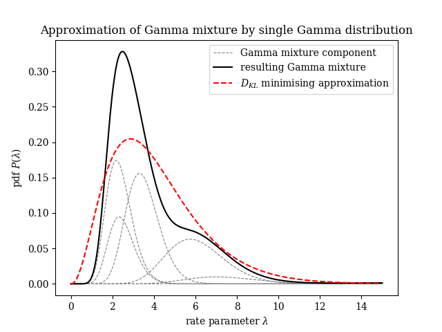

# hybrid discrete/continuous hidden Markov model with Poisson noise

## `gamma_approx` library

### Purpose:

`gamma_approx` is a Python library to approximate mixtures
of Gamma distributions with a single Gamma distribution.



### Status

Prototype. Library API may change.

### License

BSD

### Quickstart for local development

1.	clone the repo
2.	ensure you have a dev environment with a C compiler
	that Cython can use
3.	Install deps, build the library and run tests:

```
python3 -m venv venv
source venv/bin/activate
pip install -r requirements.txt
make clean
make lib
python -m pytest lib
```

### Usage

The extension library `gamma_approx/_gammaapprox` defines
the following functions:

*	`fit_gamma_dist_to_gamma_mixture`
*	`fit_batch_gamma_dists_to_gamma_mixtures`
*	`rough_fit_batch_gamma_dists_to_gamma_mixtures`

The first function solves a single Gamma mixture
approximation problem, while the batch functions take
a batch of many problems and solves them iteratively.
For an example of usage of the batched fit, see the test.
The API for both functions is defined in the
`lib/gamma_approx/_gammaapprox.pyx` Cython source file.

The `rough_` variant of the `fit_batch_` function uses
a fixed number of iterations, which accelerates performance
but may give lower accuracy results for some inputs.


### Description:

The `gamma_approx` library offers routines to fit a single
Gamma distribution to approximate some given mixture of Gamma
distributions. The parameters of the approximating Gamma
distribution are chosen to minimise the KL-divergence from
the approximation to the original Gamma mixture.

For each fit, the library does the following:

1.	Computes the expected rate and expected log rate
	of the input Gamma mixture.

2.	Obtains a two-dimensional system of nonlinear
	constraints equating the expected rate and expected
	log rate of the approximation with the expected
	rate and expected log rate of the input mixture,
	respectively.

3.	Computes the optimal value of the approximating
	shape parameter by solving a one-dimensional
	problem to invert the function `y = digamma(x) - log(x)`.
	This is perfomed numerically using Halley's
	method, using a series approximation for `digamma`.

4.	Solves for the optimal value of the remaining rate
	parameter in terms of the optimal shape parameter
	and the input data. In constrast to step 3, this is
	immediate.

Note that performance appears to be greatly accelerated when
solving large batches of these approximation problems.

### Performance (single core)

The "rough" lower-accuracy batched implementation
can fit 320k randomly-sized mixtures, each consisting
of 1 -- 20 component Gamma distributions in around 0.106
seconds on an AMD 2200G CPU, using a single core.
That is:

*	331 nanos per mixture fit, or equivalently
*	3 million mixture fits per second.
